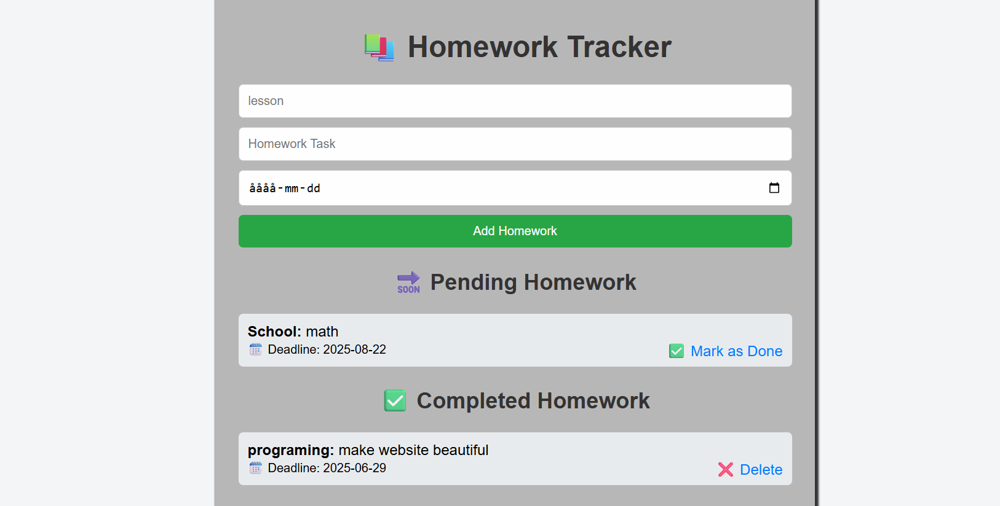

# 📚 Homework Tracker

A simple and efficient Homework Tracker web app to help students manage their tasks. Built with **Flask**, **HTML/CSS**, and **Python**, this application allows users to add, view, complete, and delete homework tasks. Tasks are organized into **Completed** and **Pending** sections for easy tracking.

🔗 **Live Version:** [https://homework-tracker-xmcv.onrender.com/](https://homework-tracker-xmcv.onrender.com/)

---

## ✨ Features

- ✅ Mark tasks as **Completed**
- 📌 View **Pending** and **Completed** tasks separately
- 🗑️ Delete individual tasks
- 💾 Data stored on the server (session-based or persistent depending on your implementation)
- 📱 Clean, user-friendly interface

---

## 🖼️ Screenshot

<!-- Replace this path with the actual image path when available -->


---

## 🚀 Tech Stack

- **Frontend:** HTML, CSS
- **Backend:** Python, Flask
- **Version Control:** Git, GitHub
- **Deployment:** Render

---

## 🔧 Setup Instructions

1. **Clone the repository**

   ```bash
   git clone https://github.com/your-username/your-repo-name.git
   cd your-repo-name
